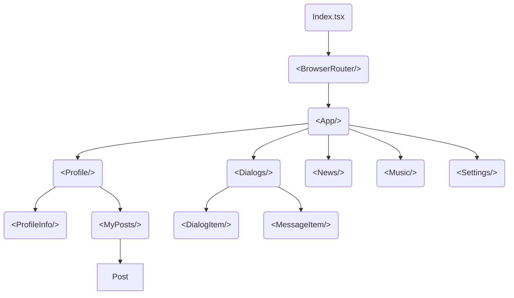

# Samurai way (ts)

### Библиотеки:

- **antd**
- **axios**
- **classnames**
- **formik**
- **gh-pages**
- **jest**
- **react** and **@types/react**
- **react-dom** and **@types/react-dom**
- **react-redux** and **@types/react-redux**
- **react-router-dom** and **@types/react-router-dom**
- **react-scripts**
- **react-test-renderer** and **@types/react-test-renderer**
- **redux**
- **redux-form** and **@types/redux-form**
- **redux-thunk**
- **reselect**
- **typescript**
- **uuid** and **@types/uuid**

## Внутри приложения:
